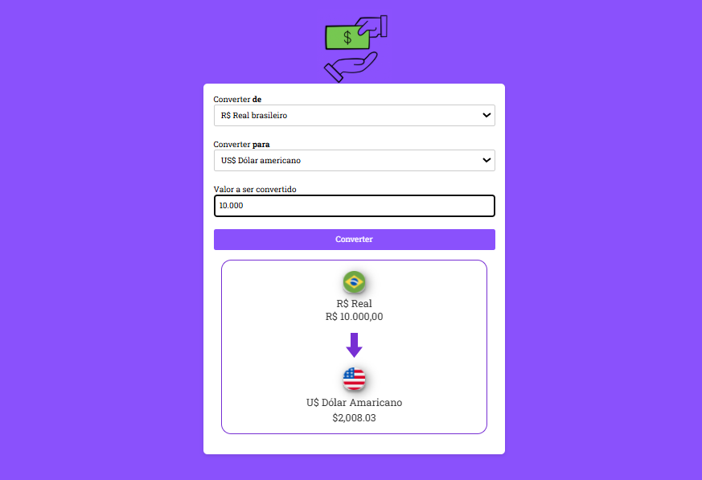

# 💱 Conversor de Moedas

Projeto desenvolvido com foco em prática de JavaScript, manipulação de DOM e lógica de programação.

## 🚀 Funcionalidades

* Conversão de Real (BRL) para:

  * Dólar (USD)
  * Euro (EUR)
  * Iene Japonês (JPY)
  * Libra Esterlina (GBP)
  * Bitcoin (BTC)
* Atualização dinâmica ao clicar no botão
* Troca de bandeira e nome da moeda automaticamente
* Formatação de valores com `Intl.NumberFormat`

## 🛠️ Tecnologias utilizadas

* HTML5
* CSS3
* JavaScript (Vanilla JS)

## 📸 Preview do projeto



## 📂 Estrutura do projeto

📁 assets
📁 css
📁 js
index.html
```

## 📚 Aprendizados

Durante o desenvolvimento deste projeto, pratiquei:

* Manipulação de elementos com `querySelector`
* Eventos com `addEventListener`
* Conversão de valores
* Uso de condicionais (`if`)
* Formatação de moedas com JavaScript

## ⚠️ Melhorias futuras

* Integração com API de cotação em tempo real (incluindo Bitcoin)
* Responsividade para dispositivos móveis
* Animações na troca de moeda
* Melhor organização do código

## 👩‍💻 Desenvolvido por

Tamires Marinho

---

💡 Projeto feito com o objetivo de evoluir como desenvolvedora front-end e em contrução!
